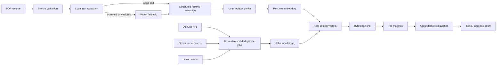

# ResuLens — Product and Architecture Context

Last reviewed: 2026-09-10

## Product

ResuLens is a resume-first job discovery web application. A user uploads a PDF resume, reviews the structured profile extracted from it, and receives ranked, explainable job matches from approved job APIs and public ATS feeds.

Tagline: **Your resume, focused on the right opportunities.**

ResuLens is a fresh project. Do not copy the old JobSync application or preserve its architecture by default. Reuse a previous idea only after validating that it fits this product and current dependencies.

## Core User Workflow

1. The visitor selects a PDF and signs in before it is uploaded.
2. The browser uploads the PDF directly to a private Supabase Storage bucket through a short-lived signed URL.
3. An asynchronous worker validates the PDF and extracts its text.
4. If normal extraction is insufficient, a bounded vision/file-input fallback processes the scanned pages.
5. OpenAI Structured Outputs converts the extracted content into a validated resume profile.
6. The user reviews and corrects the profile and supplies job preferences.
7. Hard eligibility filters remove unsuitable jobs.
8. PostgreSQL full-text search and pgvector retrieve relevant jobs.
9. A deterministic scoring function ranks the candidates.
10. The LLM explains only the strongest matches using stored evidence.
11. The user saves, dismisses, or visits the canonical source page to apply.



## Product Boundaries

### MVP

- Clerk-managed Google OAuth and email authentication
- Private PDF resume upload
- Text extraction with a scanned-PDF fallback
- Structured, editable resume profile
- Job ingestion from Adzuna and curated Greenhouse and Lever boards
- Hybrid job matching and evidence-backed explanations
- Match feed, job detail, saved, dismissed, and applied states
- User preferences and complete data deletion
- Automated ingestion, embedding, retry, and expiry workflows
- Production monitoring without logging resume content

### Not in the MVP

- Automatic job applications
- ATS friendly resume builder
- ATS Score check
- LinkedIn or Indeed scraping
- Browser automation using a user's credentials
- Resume rewriting or cover-letter generation
- Subscription billing
- Recruiter or team dashboards
- Native mobile applications
- A chat-based career agent
- A custom-trained ranking model

## Architecture Principles

- The LLM is not a scraper and does not assign the numeric match score.
- Prefer documented APIs and public ATS feeds over browser scraping.
- Use deterministic filters before semantic retrieval.
- Treat match scores as product rankings, not hiring probabilities or ATS scores.
- Every extracted fact and match explanation must be traceable to source evidence.
- Users must approve or correct extracted profile data before matching.
- Keep route handlers thin; put domain logic in services and persistence in repositories.
- Keep provider-specific job ingestion behind a shared adapter interface.
- Run PDF parsing, AI calls, ingestion, and embedding generation asynchronously with retries.
- Use stable releases only. Do not introduce canary, preview, or experimental dependencies without an accepted design decision.
- Resolve current stable package versions during initial scaffolding and pin the lockfile.

## Initial Technical Baseline

| Area                     | Decision                                                                                                    |
| ------------------------ | ----------------------------------------------------------------------------------------------------------- |
| Runtime                  | Node.js 24 LTS                                                                                              |
| Web framework            | Next.js 16.3.4 App Router                                                                                   |
| UI runtime               | React and React DOM 19.2.8                                                                                  |
| Language                 | TypeScript 6, strict mode                                                                                   |
| Styling                  | Tailwind CSS 4.3, shadcn/ui, Radix primitives, Lucide icons                                                 |
| Validation               | Zod 4.5                                                                                                     |
| Authentication           | Clerk for users, sessions, Google OAuth, email authentication, and account UI                               |
| Data platform            | Supabase PostgreSQL, Storage, Realtime, Edge Functions, Queues, Cron, and pgvector                          |
| Supabase clients         | `@supabase/supabase-js` with Clerk `accessToken` callbacks; Clerk owns browser and server session lifecycle |
| PDF extraction           | `unpdf`, initially pinned to the latest validated stable release                                            |
| AI                       | Official OpenAI JavaScript SDK and Responses API                                                            |
| Default LLM              | `gpt-5.6-luna`                                                                                              |
| Escalation LLM           | `gpt-5.6-terra` for low-confidence or unusually formatted resumes                                           |
| Embeddings               | `text-embedding-3-small`                                                                                    |
| Unit/integration testing | Vitest 5, React Testing Library, MSW, and pgTAP                                                             |
| End-to-end testing       | Playwright 1.63                                                                                             |
| Hosting                  | Vercel for Next.js; Supabase for data and background workloads                                              |
| Observability            | Sentry and structured, PII-safe logs                                                                        |
| Public endpoint limiting | Upstash Redis/Ratelimit before public beta                                                                  |
| Package manager          | npm with a committed `package-lock.json` and pinned `packageManager` field                                  |

Version numbers above are the approved starting baseline, not permission to skip compatibility checks. Verify current stable patch releases, release notes, and peer-dependency compatibility immediately before scaffolding or upgrading.

### Phase 1 foundation status

- Next.js 16 App Router, React 19, TypeScript strict mode, Tailwind CSS 4, Vitest, Playwright, ESLint, and Prettier are scaffolded with pinned versions and a committed npm lockfile.
- Clerk is the only authentication/session owner. The protected `/dashboard` route and private server resources re-check `auth()`/`requireUser()`; `proxy.ts` is only an early routing check.
- Supabase receives the Clerk session token through `@supabase/supabase-js`. The initial `profiles` and worker-only `clerk_webhook_events` tables use text Clerk subjects and RLS policies based on `((select auth.jwt()) ->> 'sub')`.
- The hosted ResuLens Supabase project has its native Clerk third-party auth connection enabled for the development Clerk domain; the exact domain remains environment-specific and is not committed to local configuration.
- The ResuLens development Clerk instance has its Supabase integration enabled, so newly issued Clerk session tokens include the Supabase-compatible `role` claim. Existing sessions must refresh after this setting changes.
- The hosted ResuLens development Supabase project has both Phase 1 migrations applied and passes the Supabase security/performance advisor checks. Hosted profile RLS pgTAP verification passes; local pgTAP execution still requires Docker Desktop or Podman.
- The product shell is dark-only and follows `design.md`: a near-black instrument canvas, white pill actions, compact charcoal surfaces, signal-blue focus/selection states, one restrained violet/coral analysis field, accessible focus states, and reduced-motion handling across public, auth, and protected surfaces.
- Clerk account components use the hosted Clerk UI bundle through `ClerkProvider`; ResuLens keeps its dark appearance in namespaced `appearance.elements` classes and does not ship the vulnerable bundled `@clerk/ui` dependency.
- Protected API requests with no Clerk credential take a bounded signed-out fast path so they return a safe 401 without a browser handshake; requests carrying a credential continue through Clerk middleware, and the route handler still re-checks `requireUser()`.

### Phase 2 resume intake status

- The authenticated dashboard now owns the resume workflow: direct signed upload, upload completion, processing status, scan history, retry, profile review, approval, and deletion. The upload surface is `/dashboard` after Clerk sign-in; the public landing page intentionally does not accept resume bytes.
- Phase 2 source includes the `resumes`, `resume_profiles`, and `resume_processing_jobs` schema migration. The migration creates a private `resumes` bucket with a five-megabyte PDF limit, explicit Storage policies, ownership RLS, profile version constraints, and the durable `resume_processing` Supabase Queue. Queue messages carry only opaque identifiers; the relational table is the safe status ledger. The linked hosted development project has this migration applied; local/staging environments still require their own migration run before enabling uploads.
- Resume bytes upload directly from the browser with a short-lived Supabase signed upload token created by a server-authorized route. The browser never receives the service-role key, OpenAI key, or worker secret. AI-processing consent is required before the token is issued.
- PDF processing is bounded and asynchronous. The worker validates PDF signature/MIME/size/page count, rejects encrypted or malformed files, extracts text with `unpdf`, and marks weak extraction for the vision/file-input fallback. Processing stages and safe retryable/terminal errors are persisted without logging resume content.
- The Supabase Edge Function `process-resumes` consumes at most three durable processing jobs per invocation and calls the server-only Node processor. The processor re-checks deletion state immediately before writing profile data; deletion cascades profile and queue rows and removes the private object.
- OpenAI Responses Structured Outputs uses the versioned Zod profile schema, `store: false`, bounded output, page/evidence references, confidence values, and server-only model configuration. The default and escalation model names remain environment-configurable until evaluation locks a production snapshot.
- Profile edits create draft versions; approval creates an approved version and clears `derived_profile_version`. Future embeddings and matches must compare their source version with the approved profile version before use.
- Hosted resume RLS pgTAP verification passes for same-user access, cross-user denial, queue-row protection, ownership-reassignment protection, and anonymous denial; synthetic test data rolls back cleanly. Local execution remains Docker-dependent.

### Phase 3 job-ingestion status

- The shared job-source contract is implemented under `src/server/job-sources`. It bounds provider responses, retries transient failures, validates external JSON with Zod, normalizes records, strips provider HTML to plain text, canonicalizes HTTPS source URLs, and records a SHA-256 content fingerprint.
- Adzuna search, Greenhouse Job Board, and Lever Postings adapters use their documented public endpoints. Provider credentials remain server-only; curated board/site identifiers live in `job_sources.provider_config` and never contain secrets.
- The hosted schema includes `job_sources`, `companies`, `job_postings`, `job_skills`, and `ingestion_runs`. A private `private.job_posting_payloads` table keeps raw provider payloads out of the Data API. The normalized job table has explicit RLS, a generated simple-language `tsvector`, GIN search index, provider identity uniqueness, stale-listing expiry support, and authenticated read-only access.
- The bounded Next.js internal worker route and `ingest-jobs` Edge Function isolate provider failures, retain safe run counts/errors, upsert idempotently, refresh skills and private payloads, and expire unseen jobs only after a complete successful source refresh. No embeddings, authoritative match scores, or LLM explanations are part of this phase.
- `/dashboard/jobs` and `/api/jobs` expose only normalized active listings to authenticated users. Empty and provider-failure states are explicit; raw payloads and provider credentials never reach the client.
- The hosted Phase 3 RLS suite passes through the linked Supabase SQL runner with the `pgtap` extension enabled; its synthetic transaction rolls back cleanly. Local pgTAP still requires Docker Desktop or Podman, which is not part of the user's development setup.

### Phase 4 matching status

- The hosted schema now includes `candidate_preferences`, private resume/job embedding tables, bounded `embedding_jobs`, versioned `match_runs`, `job_matches`, cached `job_match_explanations`, `job_actions`, and `job_feedback`. The linked `resulens` project has the Phase 4 foundation, hardening indexes/deny policies, pending-run uniqueness, unknown-metadata retrieval, and match-reference integrity migrations applied.
- Approved resume profiles are converted into bounded professional-content embeddings that intentionally exclude names, email, phone numbers, locations, and raw evidence excerpts. Normalized job content is embedded separately. Supabase Queues carries only opaque embedding-job identifiers; the Edge Function and Node processor retry up to three attempts and re-check deletion, approval version, job status, and content fingerprints immediately before writing derived vectors.
- The matching service applies explicit country, workplace, role-exclusion, work-authorization, experience, and status constraints before retrieving a union of PostgreSQL full-text and pgvector candidates. Confirmed conflicts are removed; missing provider or profile fields are retained as explicit unknowns. Deterministic scoring uses semantic 40%, skills 25%, role/seniority 15%, location 10%, freshness 5%, and salary 5%, renormalizing only available signals.
- `/dashboard/matches` and the protected matching APIs provide versioned feed runs, preference controls, score breakdowns labelled **ResuLens match score**, job details, source links, save/dismiss/applied actions, and relevance feedback. Opening a canonical source URL never marks a job as applied. Editing preferences or approving a new profile changes the persisted revision used by the next run.
- Explanations use OpenAI Responses Structured Outputs with Zod, `store: false`, bounded evidence-only prompts, quote validation, model/prompt/input version hashes, and safe cached failure rows. An explanation failure leaves deterministic ranked results visible.
- The reviewed synthetic ranking fixture passes the release gate: no hard-conflict result is included, and the hybrid ordering beats the keyword-only baseline on precision@10 and nDCG@10. Hosted Phase 4 RLS transaction tests pass 20 assertions with synthetic rows rolled back, including service-role rejection of cross-user match references; linked security/performance advisors report no error-level findings.
- Live worker/provider verification remains an external deployment task. The linked development project currently has no deployed Edge Functions, and the configured OpenAI project currently rejects synthetic requests because its credit balance is exhausted. Before enabling paid processing, fund API usage, deploy `process-embeddings`, configure `MATCHING_WORKER_SECRET` and a reachable `RESULENS_APP_URL`, schedule the function, run a synthetic approved-resume/job smoke test, and benchmark the HNSW index with representative data.

### Phase 5 production-readiness status

- Account settings expose two source-PDF policies: delete immediately after profile approval, or retain privately for 30 days. This setting is deliberately separate from the approved structured profile, which remains available until the resume or account is deleted.
- Account deletion is coordinated through a durable service-role-only ledger. The application marks the account first so database triggers reject new applicant work, revokes Clerk sessions, removes Storage objects through the Storage API, deletes the profile cascade and derived rows, deletes the Clerk user, and retains enough cleanup state to retry a partial failure.
- Authenticated sessions may update only onboarding and raw-file-retention preferences on `profiles`. Deletion state and direct profile deletion are service-controlled so a browser client cannot bypass coordinated Storage and Clerk cleanup.
- `maintain-production` is the bounded scheduled recovery worker. It retries account cleanup, removes expired PDFs, and recovers resume/embedding locks older than ten minutes without placing applicant identifiers or content in its response.
- Sentry is optional at runtime and uses `sendDefaultPii: false`, low configurable trace sampling, and a recursive event/breadcrumb scrubber. Provider dashboards and alerts are environment configuration, not source-code completion.
- Development, staging, and production must use separate Clerk, Supabase, OpenAI, worker, Sentry, and job-source credentials. Database backup and Storage recovery are distinct; Supabase database backups do not contain Storage objects.
- Production deployment remains blocked until the repository launch checklist has current staging integration, deletion, monitoring, latency, cost, backup, and rollback evidence.
- Source-level Phase 1–5 verification passes on Node 24, and hosted migrations are synchronized through `20260911022141_phase_completion_hardening`. This does not constitute a staging or production launch: provider credentials, workers, monitoring destinations, backup/rollback evidence, and the complete authenticated synthetic journey still require live verification.

## AI Contract

Use the OpenAI Responses API with JSON Schema Structured Outputs and `store: false` for resume processing. Keep the API key server-side.

The structured resume profile should include:

- Contact information
- Candidate headline and likely role families
- Employment entries with dates and duration
- Skills with supporting evidence
- Education, certifications, and projects
- Measurable achievements
- Observed locations and estimated seniority
- Total experience
- Per-field confidence and source page/evidence
- Ambiguity and missing-information warnings

Never invent a field. Return an absent or low-confidence value for uncertain information and request user confirmation in the UI.

Use local PDF text extraction first. Send only the required normalized text to the model when possible. For image-only resumes, bound the file size, page count, image resolution, processing time, and memory before using vision/file input.

## Job Ingestion

Initial provider adapters:

- Adzuna for broad keyword/location discovery
- Greenhouse Job Board API for curated employer boards
- Lever Postings API for curated employer boards

All adapters implement the same sequence:

`fetch -> validate -> normalize -> sanitize -> deduplicate -> upsert -> embed -> activate/expire`

Requirements:

- Retain canonical source URLs and required attribution.
- Use `(source_id, external_job_id)` as the primary provider identity.
- Keep a source-specific content fingerprint for change detection and a separate cross-posting key for grouping likely duplicates without discarding provider identity.
- Sanitize all provider HTML before displaying it.
- Keep raw provider payloads private and out of client responses.
- Refresh on a configurable schedule, initially every four to six hours.
- Record run status, counts, retry attempts, failures, and rate-limit responses.
- Expire a listing when the source closes it or after the configured stale threshold. Phase 3 expires unseen active listings only after a complete, error-free provider refresh; partial runs leave existing listings active until a later complete run.

## Matching

Apply hard constraints first: location, work authorization, workplace type, role exclusions, seniority, required experience, and freshness.

Retrieve candidates using PostgreSQL full-text search and pgvector similarity. Start with this scoring model:

| Signal                               | Weight |
| ------------------------------------ | -----: |
| Semantic similarity                  |    40% |
| Required and preferred skill overlap |    25% |
| Role title and seniority             |    15% |
| Location and workplace preference    |    10% |
| Posting freshness                    |     5% |
| Salary preference                    |     5% |

Renormalize weights when optional provider data, such as salary, is unavailable. Do not penalize a candidate for data the provider omitted.

LLM explanations are grounded summaries of calculated evidence. They must distinguish strong matches, transferable strengths, missing requirements, and unknowns.

## Data Model

Expected core tables:

- `profiles`
- `clerk_webhook_events` (worker-only idempotency records)
- `candidate_preferences`
- `resumes`
- `resume_profiles`
- `resume_experiences`
- `resume_skills`
- `companies`
- `job_sources`
- `job_postings`
- `job_skills`
- `ingestion_runs`
- `private.job_posting_payloads` (worker-only raw provider payloads)
- `resume_embeddings` (service/worker-only derived vectors)
- `job_posting_embeddings` (service/worker-only derived vectors)
- `embedding_jobs` (service/worker-only retry ledger)
- `match_runs`
- `job_matches`
- `job_match_explanations`
- `job_actions`
- `job_feedback`
- `processing_failures`
- `account_deletion_jobs` (service-role-only retry ledger retained after profile deletion)

Use relational columns for fields used by filters, joins, authorization, and indexes. JSONB is suitable for private raw provider payloads and infrequently queried metadata, not as a substitute for a deliberate schema.

Expected indexes include:

- B-tree indexes on every RLS ownership/filter column, especially `user_id`
- Unique `(source_id, external_job_id)`
- Indexes for job status, location, workplace type, seniority, and `posted_at`
- GIN full-text indexes on normalized job content
- HNSW vector indexes after representative data and query benchmarks exist; the initial index is present, but production tuning is deferred until the live corpus is representative

## Security and Privacy Invariants

- Require authentication before uploading resume bytes.
- Store resumes in a private bucket under a user-owned path.
- Validate the PDF signature, MIME type, byte size, page count, encryption state, processing duration, and resource use.
- Default limits are 5 MB and 5 pages until benchmark evidence justifies changes.
- Never execute PDF scripts, expose raw uploads publicly, or parse unbounded content in a request handler.
- Enable RLS on every exposed table and define explicit grants and per-operation policies. For Clerk-backed rows, authorize with the immutable JWT subject claim `((select auth.jwt()) ->> 'sub')`, never editable Clerk metadata.
- Treat Clerk webhook verification and idempotency as reliability infrastructure; do not make authorization correctness depend on webhook delivery.
- Test that users cannot access another user's resume, profile, preferences, matches, feedback, or storage objects.
- Keep service-role, OpenAI, and job-provider credentials server-only; never prefix them with `NEXT_PUBLIC_`.
- Do not place resume text, names, contact data, storage URLs, or model prompts in logs, analytics, traces, or error messages.
- Obtain explicit consent before sending resume information to an AI provider.
- Provide raw-PDF retention controls and complete user-data deletion.
- Rate-limit upload, processing, matching, and feedback endpoints.
- Treat dependency and framework security patches as release-blocking updates.

## Planned Repository Shape

```text
src/
  app/
    (marketing)/
    (auth)/
    (product)/
    api/
  components/
    ui/
    layout/
  features/
    auth/
    resumes/
    jobs/
    matching/
    feedback/
  lib/
    ai/
    database/
    security/
    supabase/
    validation/
  server/
    job-sources/
    matching/
    repositories/
    services/
supabase/
  functions/
  migrations/
  tests/
  seed.sql
tests/
  e2e/
  evals/
  fixtures/
  integration/
```

Do not create layers or folders merely to match this diagram. Add them when an implemented feature has a real owner.

## Quality Gates

Every merge-ready change must pass the checks relevant to its scope:

- Formatting and ESLint
- TypeScript strict type-checking
- Focused unit and integration tests
- Supabase migration reset and pgTAP/RLS tests for database changes
- Production Next.js build
- Playwright tests for affected critical user workflows
- Accessibility checks for changed interactive UI
- Secret and PII review for logging, errors, fixtures, and snapshots

Use synthetic resumes and job descriptions in the repository. Never commit real applicant data.

## MVP Definition of Done

- A user can upload and process a valid one-to-five-page PDF.
- Normal and scanned resume paths have clear success and failure handling.
- Extracted facts are editable and supported by resume evidence.
- Processing failures can be retried and never leave an endless loading state.
- Jobs refresh automatically and duplicates and stale records are controlled.
- Ranking combines eligibility, lexical search, semantic similarity, and freshness.
- Match explanations contain no unsupported claims.
- RLS and storage-isolation tests pass.
- Critical mobile and desktop journeys pass Playwright.
- Critical screens meet WCAG 2.2 AA expectations.
- A user can delete the uploaded resume and all derived private data.

## Delivery Order

1. Initialize Git, Next.js, package pinning, linting, tests, and CI.
2. Create local Supabase configuration, schema migrations, generated types, and RLS tests.
3. Implement authentication, private storage, and direct signed uploads.
4. Implement asynchronous PDF processing and profile review.
5. Implement and verify job-source adapters.
6. Add embeddings, hybrid retrieval, deterministic scoring, and evaluation fixtures.
7. Build match, job detail, save, dismiss, and apply-out workflows.
8. Add monitoring, rate limits, retention/deletion, accessibility, and production deployment.
